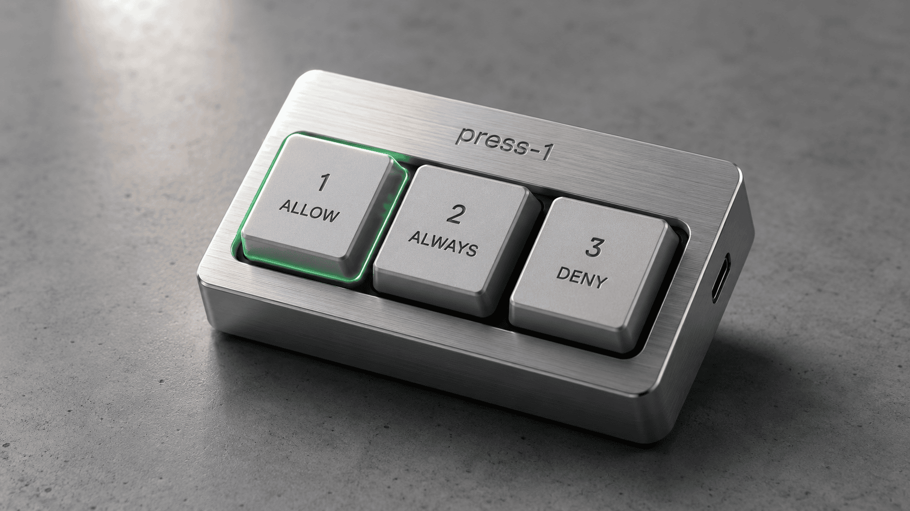
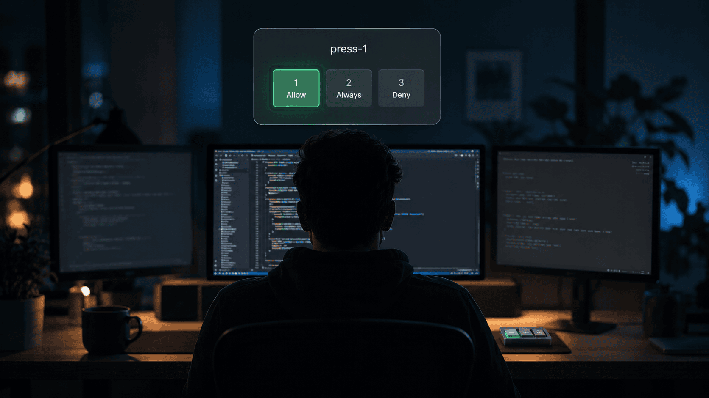
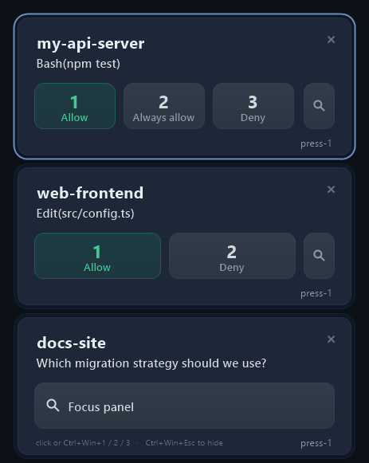
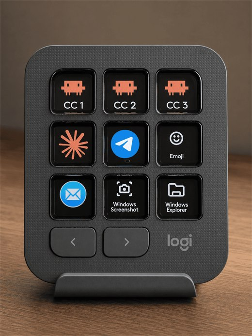
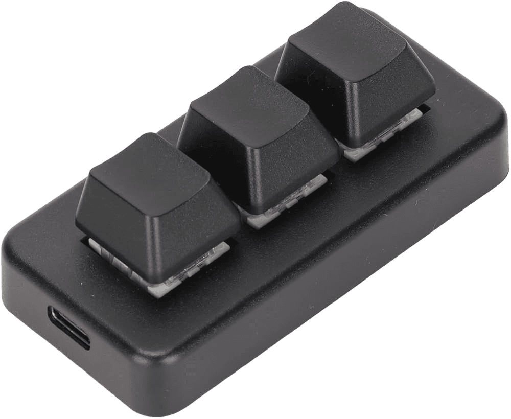

<div align="center">

# ⌨️ press-1

**Answer Claude Code's permission prompts with a single keypress — from any window, on any monitor, without switching focus.**

**English** · [Русский](README.ru.md)

[](../../releases/latest)


[](LICENSE)



</div>

---

AI coding agents like Claude Code stop and ask before they do anything consequential — *run this command? edit this file? delete that?* The catch: the prompt appears wherever the agent happens to be running, which is rarely the window you're looking at. So the agent sits and waits, you lose time and flow hunting for the prompt — or worse, you never notice it and your agent is just idle.

**press-1 surfaces every waiting prompt in one small always-on-top popup, plays a soft sound, and lets you answer with a single global hotkey — without leaving whatever you're doing — or with a click in the popup itself. Either way your focus stays put.** Every decision is still yours; press-1 just removes the window-hunting between you and the prompt.



## Why you'll want it

- **Several monitors** — A prompt pops up on a screen you're not looking at. Normally that's reach for the mouse → click into the window → answer: a handful of actions across the desk. press-1 collapses it to one hotkey — no mouse, no focus change.
- **One screen, lots of windows** — Your editor or terminal is buried under other windows and you don't even see the prompt. The agent waits while you think it's working — pure lost time. press-1 makes sure you always see *and* hear it.
- **Even on a laptop** — You kicked off a task and threw a YouTube video on top of the terminal. The sound and popup tell you the moment you're needed, and you can approve without closing the video.
- **Context, right in the popup** — The popup shows what's being asked (the command, the file, the question), so most of the time you can decide without ever looking at the terminal. Need the full picture? One button jumps you straight to the right window.
- **A soft, unobtrusive sound** lets you know attention is needed — and it's one click to mute if you'd rather keep things quiet.
- **No keyboard needed** — You can handle prompts entirely with the mouse, clicking right in the popup.

## The popup



- A frosted card stack, one card per waiting prompt — oldest at the top. Hotkeys answer the **selected** card (the one with the highlighted ring); `Ctrl+Win+↑/↓` moves the selection.
- Each card shows the one action that's waiting — `Bash(npm test)`, `Write(src/config.ts)`, and so on.
- Buttons map to the real 2- or 3-option layout and are clickable. `🔍` focuses the prompt's window **without** answering.
- A card disappears the moment its prompt is resolved anywhere — answered *or* cancelled by hand in the terminal.

## Hotkeys

Out of the box: **Ctrl+Win+1 / 2 / 3** answer the selected prompt (option 1 / 2 / 3), and **Ctrl+Win+Esc** hides the popup. The buttons always mirror the prompt's real options, so a digit never means something different from what you see.

Prefer dedicated keys? Map them to **whatever hardware you like** — a macro pad, a mini keyboard, a stream-deck-style console, a keypad with little screens. press-1 also listens on `F13`–`F24`, so anything that can send those works. Use whatever's comfortable.

<table align="center">
  <tr>
    <td align="center">
      <br>
      <sub><b>My own setup</b> — a Logitech MX Creative Console; the top row (CC&nbsp;1/2/3) answers press-1.</sub>
    </td>
    <td align="center">
      <br>
      <sub><b>Or go minimal</b> — a 3-key macro pad is cheap, tiny, and does the whole job.</sub>
    </td>
  </tr>
</table>

## Not an auto-approver

This is the important part: **press-1 never answers for you.** It doesn't approve anything automatically, doesn't bypass prompts, doesn't "trust" commands. Every prompt stays a deliberate decision — one keypress (or click) each. press-1 only makes that decision instant to reach. You get all three options exactly as the prompt offers them: **Allow**; **Always allow**, which saves the rule just like clicking the native button; and **Deny**, which sends the agent a proper "denied by user" message.

## Where it works

Claude Code runs in a few different places on Windows, and press-1 covers each:

- **Your editor — VS Code, [Cursor](https://cursor.com/), or [Windsurf](https://windsurf.com/)** — both the in-editor permission box and the integrated terminal. Cursor and Windsurf are VS Code forks; press-1 treats all three the same.
- **Windows Terminal** — and standalone `cmd` / PowerShell windows

Not every prompt is a simple yes/no — approving a plan, or picking from a list of options. press-1 won't guess those for you: it surfaces them in the popup as an attention card, and the hotkey jumps you straight to the right window so you can answer there.

## Install

**The fast way — one line.** It installs the prerequisites it needs (AutoHotkey v2 and Node.js, via `winget`, only if they're missing) and then press-1 itself:

```powershell
irm https://raw.githubusercontent.com/egsok/press-1/main/bootstrap.ps1 | iex
```

That's it — you're done. (If you're upgrading from an older press-1, the installer will tell you to reload your editor windows once.)

**Prefer to read the code first?** Clone the repo, look it over, and run the same installer:

```powershell
git clone https://github.com/egsok/press-1
cd press-1
.\install.ps1
```

`install.ps1` checks for **[AutoHotkey v2](https://www.autohotkey.com/)** and **[Node.js](https://nodejs.org/)**, offers to install whichever is missing via `winget`, sets everything up, and (re)starts AutoHotkey. You're set.

**Requirements:** Windows 10/11, Claude Code 2.1.x, and an editor — VS Code, Cursor, or Windsurf (for the in-editor scenarios). `winget` (built into current Windows) powers the automatic prerequisite install — without it, install the two prerequisites by hand and re-run.

> **In a hurry?** Hand the repo to your Claude Code agent and ask it to install press-1 — it'll do exactly this. That's the kind of chore it's built for.

<details>
<summary><b>What the installer actually does</b></summary>

<br>

- Installs any missing prerequisite (**AutoHotkey v2**, **Node.js**) via `winget`, after asking — or tells you loudly if `winget` isn't available.
- Copies the two hooks (`permission-request.js`, `session-teardown.js`) to `~\.claude\hooks\`.
- Merges its hook entries into `~\.claude\settings.json` **safely** — only its own entries are touched, your other hooks and settings survive, and a backup is written first. Invalid JSON → it stops loudly and changes nothing.
- Copies the resident script (`press-1.ahk` + its tray icon) to `~\scripts\` and adds a startup shortcut.
- (Re)starts AutoHotkey so the new version is live.

</details>

## Limitations (by design)

- **Windows only**, for now — and Claude Code has to run on this same machine. If it runs on a remote box (SSH/tmux), press-1 can't see its prompts.
- **60-minute answer window** — after that the row disappears and you answer in the terminal/box as usual (the prompt stays answerable there the whole time; answering there always wins instantly).
- **Auto permission mode:** when Claude Code's own classifier decides, no prompt fires and press-1 stays silent — nothing was waiting for you.
- **Picker / question / plan prompts** are focus-only: digits are never typed blindly into a window that might not have the keyboard focus you expect.
- **Some terminal-only states aren't surfaced** — in-app menus (like `/model`) and free-text inputs don't pop up; you handle those in the terminal directly. press-1 covers permission prompts plus plan-approval and multiple-choice questions.

## How it works

A `PermissionRequest` hook writes a small pending file (tagged with where the prompt is — panel / VS Code terminal / Windows Terminal), plays the sound, and a resident AutoHotkey script shows the popup. Answers are addressed to a **specific** prompt — if the prompt is gone, the answer is dropped, never retyped into an innocent window.

| Repo file | Purpose |
|-----------|---------|
| `permission-request.js` | the hook: pending file, sound, decision wait |
| `session-teardown.js` | removes prompts answered elsewhere |
| `press-1.ahk` | resident script: hotkeys, popup, routing |
| `install.ps1` | installer |

The full file-protocol contract is in [docs/ARCHITECTURE.md](docs/ARCHITECTURE.md) (Russian). Offline test suites live in [tests/](tests/).

## Troubleshooting

| Symptom | Check |
|---------|-------|
| No popup appears | Is AutoHotkey running (tray icon)? Are the hook entries in `~\.claude\settings.json`, and is `node` in `PATH`? |
| Popup shows but hotkeys don't answer | the `PermissionRequest` hook's `timeout` must be ≥ 3660 (the installer sets this) |
| Editor terminal prompts not detected | if you just upgraded, reload the editor window once (Command Palette `Ctrl+Shift+P` → **Developer: Reload Window**); otherwise check the hook is in `~\.claude\settings.json` and `node` is in `PATH` |
| Per-monitor hotkey hits the wrong window | `Ctrl+Win+D` shows the detected windows and monitor order |

## Credits

Made by AI 🤖 · checked by human.

Built on [AutoHotkey v2](https://www.autohotkey.com/) — the popup, hotkeys, and routing are all AHK. The frosted popup uses a vendored copy of the [AHKv2-Gdip](https://github.com/buliasz/AHKv2-Gdip) GDI+ library, and the hooks run on [Node.js](https://nodejs.org/).

## Author

Built by [Egor Sokolov](https://egorsokolov.ru/) — 10 years in product (Sberbank, Rolf, Claustrophobia). Writing and experimenting with AI tooling — mostly Claude Code, Codex, and dev workflow tooling.

📣 My Telegram, where I geek out about AI tooling:

[](https://t.me/+AHKYCN02eONjYTVi)

Other open-source experiments:

- [plan-tango](https://github.com/egsok/plan-tango) — a Claude ↔ Codex plan-review loop for Claude Code.
- [video-downloader2](https://github.com/egsok/video-downloader2) — a simple desktop downloader for YouTube, VK, and 1000+ sites.
- [Handy-nevinovata](https://github.com/egsok/Handy-nevinovata) — a personal fork of Handy, offline speech-to-text tuned for Russian IT.

## License

MIT — see [LICENSE](LICENSE). Copyright (c) 2026 Egor Sokolov.
