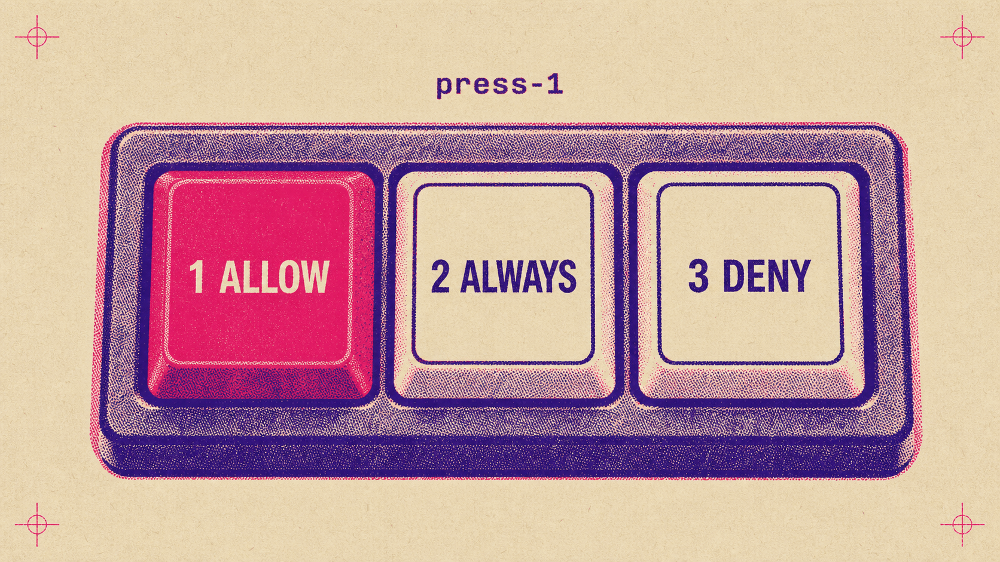
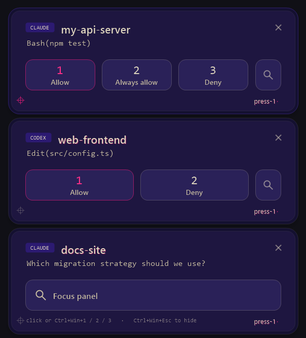
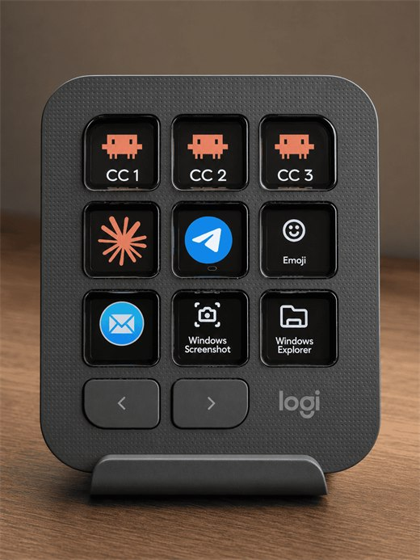
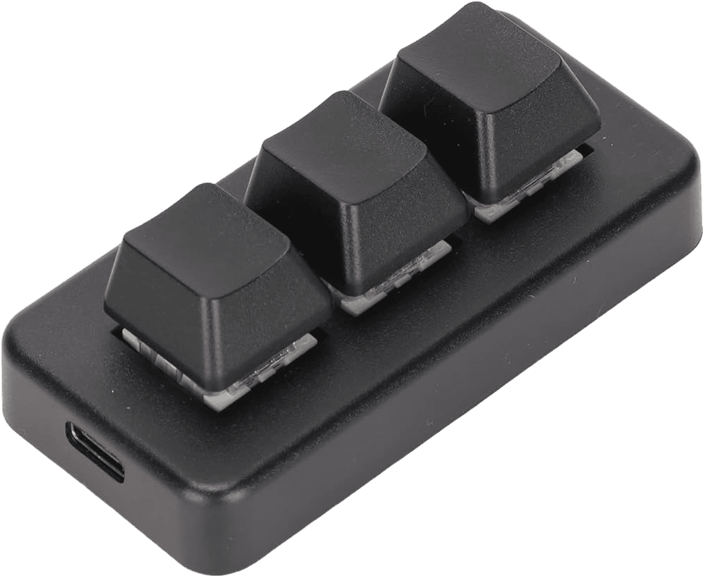

<div align="center">

# ⌨️ press-1

**Отвечайте на запросы разрешений AI-агента одним нажатием — из любого окна, на любом мониторе, не переключая фокус.**

**Русский** · [English](README.md)

[](../../releases/latest)


[](LICENSE)



</div>

---

AI-агенты вроде Claude Code и Codex останавливаются и спрашивают разрешение перед чем-то важным — *выполнить команду? изменить файл? удалить?* Загвоздка в том, что этот запрос появляется там, где работает агент, — а это редко то окно, на которое вы сейчас смотрите. В итоге агент стоит и ждёт, вы теряете время и фокус, разыскивая запрос, — а то и вовсе его не замечаете, и агент просто простаивает.

**press-1 показывает все ждущие запросы в одном маленьком окне поверх остальных, проигрывает мягкий звук и даёт ответить одним глобальным хоткеем — не отрываясь от того, чем заняты, — или мышкой прямо в окне. В любом случае фокус остаётся там, где был.** Решение всегда за вами; press-1 лишь убирает беготню по окнам между вами и запросом.


## Зачем это нужно

- **Несколько мониторов** — Запрос всплыл на экране, на который вы не смотрите. Обычно это: тянуться к мыши → кликнуть в окно → ответить — несколько действий через весь стол. press-1 сворачивает их в один хоткей — без мыши, без смены фокуса.
- **Один экран, много окон** — Редактор или терминал скрыт под другими окнами, и вы не видите запрос. Агент ждёт, пока вы думаете, что он работает, — чистая потеря времени. press-1 гарантирует, что вы всегда его увидите *и* услышите.
- **Даже на ноутбуке** — Запустили задачу и открыли YouTube поверх терминала. Звук и попап подскажут ровно в тот момент, когда вы нужны, и вы согласуете, не закрывая видео.
- **Контекст прямо в попапе** — Он показывает, что именно спрашивают (команду, файл, вопрос), так что в большинстве случаев можно решить, вообще не заглядывая в терминал. Нужны детали? Одна кнопка перенесёт вас в нужное окно.
- **Мягкий, ненавязчивый звук** даёт понять, что нужно ваше внимание — и отключается в один клик, если хотите тишины.
- **Без клавиатуры тоже** — С запросами можно работать целиком мышью, кликая прямо в попапе.

## Попап



- Стопка карточек в две краски на чернильно-фиолетовой стене, по одной на каждый ждущий запрос — старейшая сверху. Хоткеи отвечают **активной** карточке: её заголовок напечатан чётко, а в углу горит маджентовая метка приводки; карточки в очереди слегка «плывут» несведением, как оттиски в ожидании пресса. `Ctrl+Win+↑/↓` двигает выбор.
- Каждая карточка показывает, какой агент спрашивает (плашка `CLAUDE` / `CODEX`), и одно ждущее действие — `Bash(npm test)`, `Write(src/config.ts)` и так далее. У длинных команд есть **Expand ▾** (`Ctrl+Win+E`) — разворачивает полную команду прямо на карточке.
- Кнопки повторяют реальную раскладку на 2 или 3 опции и кликабельны. Обычно `🔍` фокусирует окно запроса, **не** отвечая. На карточке opt-in proxy для панели Codex, где press-1 не может адресно открыть webview, кнопка только скрывает локальный popup; родная карточка продолжает ждать.
- Карточка исчезает, когда её маршрут сообщает, что запрос решён. Точная механика различается у Claude Code и Codex — обе описаны ниже.

## Хоткеи

Из коробки: **Ctrl+Win+1 / 2 / 3** отвечают на выбранный запрос (опция 1 / 2 / 3), а **Ctrl+Win+Esc** закрывает попап без одобрения. Если запрос удерживает hook, `Ctrl+Win+Esc` сразу передаёт его обратно родному интерфейсу агента. Кнопки всегда повторяют реальные опции запроса, так что цифра никогда не значит не то, что вы видите.

Хотите выделенные клавиши? Назначьте их на **любое железо** — macro pad, мини-клавиатуру, консоль в духе stream-deck, кейпад с экранчиками. Из коробки press-1 ещё слушает `F13`–`F21`, так что подойдёт всё, что умеет их слать. Как вам удобно.

<table align="center">
  <tr>
    <td align="center">
      <br>
      <sub><b>Моя живая раскладка</b> — Logitech MX Creative Console; верхний ряд (CC&nbsp;1/2/3) — это press-1.</sub>
    </td>
    <td align="center">
      <br>
      <sub><b>Или по-минимуму</b> — 3-кнопочный macro pad: дёшево, компактно и полностью закрывает задачу.</sub>
    </td>
  </tr>
</table>

## Это не auto-approver

Важный момент: **сам press-1 никогда не отвечает за вас.** Когда он обрабатывает запрос, он ничего не одобряет автоматически, не обходит проверку и не «доверяет» командам. Каждое решение остаётся осознанным — одно нажатие или клик. Если сам агент работает в auto-режиме, press-1 может вообще не получить запрос или намеренно отойти в сторону; тогда решение принимает агент, а не press-1.

## Claude Code

Для Claude Code действует один понятный маршрут на всех поддерживаемых поверхностях: установщик регистрирует `PermissionRequest` hook, press-1 показывает запрос, а родной prompt Claude остаётся доступен одновременно. Можно ответить где угодно — проигравший маршрут закроется сам.

### Где работает

- **Панель и интегрированный терминал** в VS Code, [Cursor](https://cursor.com/) и [Windsurf](https://windsurf.com/).
- **Windows Terminal**, а также отдельные окна `cmd` и PowerShell.

Для обычного permission-запроса хоткей возвращает решение прямо ожидающему hook — без фокуса и печати цифры в чужое окно. Вопросы, выбор из списка и подтверждение плана press-1 показывает как карточку внимания: хоткей переносит в нужное окно, а ответ вы даёте в родном интерфейсе.

Обработку Claude можно отключить в трее: **Active for → Claude Code**. Установленные hooks останутся на месте, но сразу уступят родному интерфейсу.

### Ограничения Claude Code

- Окно ответа через press-1 — 60 минут; родной prompt всё это время остаётся рабочим.
- Если собственный классификатор Claude решает разрешение автоматически, hook не вызывается и press-1 молчит.
- Внутренние терминальные меню вроде `/model` и свободный текст не выносятся в попап.

## OpenAI Codex

Codex исполняет hook **до** своего интерфейса согласования. Здесь два транспортных маршрута: стандартный hook, который обычная установка включает на всех поддерживаемых поверхностях, и отдельный opt-in proxy для панели VS Code. Экспериментальный auto-review bypass — это правило внутри стандартного hook, а не отдельный Desktop-маршрут.

| Где работает Codex | Маршрут | Точный `auto_review` в текущем тёрне | Ручной режим, неопределённость или ошибка проверки |
|---|---|---|---|
| CLI в терминале редактора / Windows Terminal | Стандартный hook | press-1 молчит; решает reviewer Codex | Сначала press-1; после handoff появляется родной prompt |
| CLI в отдельном `cmd` / PowerShell | Стандартный hook | press-1 молчит; решает reviewer Codex | Только press-1 до handoff или 60-секундного таймаута |
| Панель VS Code без proxy | Стандартный hook | press-1 молчит; решает reviewer Codex | Сначала press-1; после handoff появляется родная карточка |
| Native Desktop | Стандартный hook | press-1 молчит; решает reviewer Codex | press-1 — основной интерфейс; родная карточка появляется после handoff |
| Панель VS Code с proxy | Отдельный opt-in | Не применяется: автоматически решённые действия до proxy не доходят | Родная карточка и press-1 одновременно для реального ручного запроса |

### Стандартный hook — по умолчанию

Установщик регистрирует Codex hook автоматически. В терминале редактора, Windows Terminal и обычной панели VS Code сначала открывается короткое, примерно 15-секундное окно для ответа через press-1. Если не отвечать, hook освобождает Codex и появляется родной prompt. При handoff по таймауту терминальная карточка никогда не отправляет цифру — только переводит фокус к нативному prompt. Карточка панели может остаться пультом, но отправляет опцию лишь при однозначно найденном уже активном окне; иначе тоже только фокусирует. `Ctrl+Win+Esc` делает handoff сразу и закрывает локальную карточку.

В обычном `cmd` / PowerShell и Native Desktop `Ask for approval` используется decision-only окно до 60 секунд. Если ответить через press-1, нативная карточка вообще не появляется; если сделать handoff или дождаться таймаута, запрос продолжит родной интерфейс Codex.

Для command approvals **Always allow** пытается сохранить правило по префиксу команды. Текущее действие всё равно разрешается, если правило сохранить не удалось; некоторые сложные PowerShell-команды Codex также могут не сматчить его и спросить снова.

### Auto-review bypass стандартного hook

До создания pending-файла и звука стандартный hook проверяет reviewer текущего тёрна. Это происходит на всех стандартных hook-поверхностях: в CLI внутри отдельного терминала, Windows Terminal или терминала редактора, в панели VS Code без proxy и в Native Desktop.

Bypass срабатывает только при точном совпадении `approvals_reviewer: "auto_review"` для этого же тёрна. press-1 не возвращает собственного решения и оставляет действие reviewer Codex. Значение `user`, неизвестное значение, отсутствующая, несовпадающая или конфликтующая запись, а также любая ошибка чтения, парсинга или лимита времени идут обычным popup-маршрутом. Reviewer привязан к тёрну, поэтому переключение **Approve for me / Ask for approval** применяется только к **новому тёрну** — уже идущий сохраняет прежний reviewer.

Для этой проверки hook читает только ограниченный новый хвост — до 32 MiB — текущего rollout-транскрипта, который локально хранится в `~/.codex/sessions`. press-1 никуда его не загружает и не копирует. Опциональный диагностический статус содержит только фиксированные outcome/reason, время и счётчики байт — без команд, путей, ID тёрна и содержимого транскрипта.

Интеграция включена по умолчанию и использует внутренний, version-sensitive формат Codex. Любая неопределённость безопасно возвращает обычный popup press-1. Чтобы все запросы стандартного hook всегда шли через popup, снимите отметку **Codex → Let Auto-review decide (experimental)** в трее. Файл opt-out намеренно сохранил историческое имя `~/.press-1-off-codex-desktop-auto-review`, чтобы прежняя настройка пережила обновление.

`Ctrl+Win+D` показывает результат последней проверки Codex reviewer не старше 10 минут, например `auto_pass / exact_auto_review`. Это история последнего события, а не индикатор текущего положения selector.

### Панель VS Code через proxy — advanced opt-in

Опциональный stdio-прокси `codex-mitm` работает только с панелью Codex в VS Code. Он встаёт между расширением и `codex app-server`, выставляет `PRESS1_PROXY=1`, чтобы глобальный hook и его reviewer-проба не работали для этой панели, зеркалит реальный `requestApproval` в popup и инжектит выбранный ответ обратно. Поэтому родная карточка и press-1 видны одновременно, а ответ через хоткей гасит карточку так же, как клик.

Proxy намеренно исключён из transcript-based bypass: его запросы уже прошли reviewer и являются реальными ручными согласованиями. В `Approve for me` автоматически решённые действия до proxy не доходят — popup появляется только для запроса, который Codex действительно передал на ручное согласование.

Proxy не входит в обычную установку. Чтобы включить его после one-line install, сначала клонируйте или скачайте репозиторий, затем из его папки выполните (нужен Node.js; после любой команды перезагрузите окна VS Code):

```powershell
.\enable-codex-proxy.ps1     # собирает codex-mitm.exe и задаёт chatgpt.cliExecutable
.\disable-codex-proxy.ps1    # удаляет настройку и возвращает встроенный Codex
```

Это **эксперимент, выключенный по умолчанию**:

- Канал держится на `chatgpt.cliExecutable`, которую OpenAI помечает **DEVELOPMENT ONLY**; обновление расширения может её сломать.
- Обёртка стоит на критическом пути панели, но реле построено relay-first: сбой popup-части не должен останавливать транзит кадров. Если панель забарахлила — disable-скрипт и reload окна.
- **Deny** через proxy жёстко обрывает текущий тёрн. Родная кнопка Deny отклоняет мягко и позволяет агенту продолжить.
- Enable хранит исходный `settings.json` в write-once `settings.json.press1-bak`. Disable удаляет `chatgpt.cliExecutable`, но не восстанавливает прежнее пользовательское значение автоматически — при необходимости возьмите его из бэкапа.

Дизайн и сценарии отказа описаны в [docs/DESIGN-CODEX-PROXY.md](docs/DESIGN-CODEX-PROXY.md).

### Управление Codex

- **Active for → Codex** — master switch для hooks и отображения proxy-запросов. Он не удаляет и не выключает уже включённый proxy панели: родной интерфейс остаётся доступен, а ещё живой proxy-запрос снова появится после обратного включения Codex.
- **Codex → Let Auto-review decide (experimental)** — exact same-turn `auto_review` bypass на всех стандартных hook-поверхностях; к proxy панели он не применяется.
- `enable-codex-proxy.ps1` / `disable-codex-proxy.ps1` — только транспорт панели VS Code.
- **Mute prompt sound** — звук press-1; собственные звуки Codex он не отключает.

Эти настройки переживают обновление press-1: повторная установка их не сбрасывает и не выключает уже активированный proxy.

## Установка

**Быстрый путь — одна строка.** Она сама ставит нужное (AutoHotkey v2 и Node.js — через `winget`, только если их нет), а затем и press-1:

```powershell
irm https://raw.githubusercontent.com/egsok/press-1/main/bootstrap.ps1 | iex
```

Готово. (Если обновляетесь с прежней версии press-1, установщик попросит один раз перезагрузить окна редактора.)

**Хотите сперва прочитать код?** Склонируйте репозиторий, посмотрите его и запустите тот же установщик:

```powershell
git clone https://github.com/egsok/press-1
cd press-1
.\install.ps1
```

`install.ps1` проверит **[AutoHotkey v2](https://www.autohotkey.com/)** и **[Node.js](https://nodejs.org/)**, предложит поставить недостающее через `winget`, всё настроит и (пере)запустит AutoHotkey. Готово.

**Требования:** Windows 10/11 и хотя бы один поддерживаемый агент — Claude Code и/или Codex. VS Code, Cursor или Windsurf нужны только для сценариев в редакторе. `winget` (встроен в актуальные Windows) используется для авто-установки AutoHotkey v2 и Node.js; если его нет, поставьте обе зависимости вручную и перезапустите установщик. Для trust Codex-hooks установщик умеет использовать либо команду `codex` из `PATH`, либо исполняемый файл из Native Codex Desktop. Если Codex вообще не установлен, поддержка Claude всё равно установится, а установщик явно сообщит, что опциональная поверхность Codex пропущена.

> **Некогда разбираться?** Отдайте репозиторий своему AI-агенту и попросите установить press-1 — он сделает ровно это. Та самая рутина, для которой он и нужен.

<details>
<summary><b>Что на самом деле делает установщик</b></summary>

<br>

- Ставит недостающие зависимости (**AutoHotkey v2**, **Node.js**) через `winget`, спросив, — или громко сообщает, если `winget` недоступен.
- Копирует два хука (`permission-request.js`, `session-teardown.js`) в `~\.claude\hooks\`.
- **Безопасно** мержит свои записи хуков в `~\.claude\settings.json` — трогает только свои записи, остальные ваши хуки и настройки сохраняются, бэкап пишется первым. Невалидный JSON → останавливается громко и ничего не меняет.
- Регистрирует Codex hooks в обязательной wrapper-схеме `~\.codex\hooks.json`, делает бэкап, находит Codex CLI или исполняемый файл Native Desktop и проверяет trust всех hooks press-1. Если Codex установлен, но trust подтвердить не удалось, установка громко завершается с ручным шагом `/hooks`, а не сообщает ложный успех. Неактивные top-level ключи неправильной схемы, которые сломали бы весь файл Codex, сохраняются в `.disabled-by-press-1` и удаляются из активного конфига.
- Копирует резидентный скрипт (`press-1.ahk` + иконку трея) и брендовые шрифты попапа (`fonts\`, лицензия OFL — грузятся приватно для процесса, в Windows ничего не устанавливается) в `~\scripts\`, добавляет ярлык в автозагрузку.
- (Пере)запускает AutoHotkey, чтобы новая версия была активна.
- Экспериментальный прокси Codex-панели в установку **не** входит — он включается отдельно через `enable-codex-proxy.ps1` (см. выше).
- Обновление не сбрасывает tray-настройки и не выключает ранее активированный proxy.

</details>

## Общие ограничения

- **Только Windows.** press-1 использует AutoHotkey и Win32.
- Агент должен работать на этой же Windows-машине. Запросы процесса на удалённом сервере через SSH, tmux или screen локальный press-1 не увидит.
- Вопросы и выбор из списка могут быть focus-only: press-1 не печатает цифры вслепую в окно, чей внутренний фокус нельзя доказать.
- Если отвечать в интерфейсе самого агента, а не в press-1, карточка гаснет по завершении инструмента — долгая команда держит её на экране до своего конца. Ответ хоткеем убирает карточку мгновенно.

## Как это устроено

Claude Code и стандартный маршрут Codex используют одну локальную файловую шину: hook пишет адресный pending-файл в `%TEMP%\press-1` и проигрывает звук, а резидентный AutoHotkey-скрипт показывает popup и возвращает решение именно этому запросу. Если запрос уже исчез, ответ отбрасывается — цифра не печатается в случайное окно.

### Claude Code

Родной prompt и hook работают как race: интерфейс Claude виден сразу, и побеждает первое реальное решение — из popup или из Claude. Teardown-hook убирает карточку, если запрос закрыли в родном интерфейсе: он узнаёт отвеченный запрос по завершившемуся инструменту, а остатки подчищает в конце хода.

### Codex

Стандартный Codex hook — блокирующий гейт перед родным prompt: сначала он делает точную same-turn проверку reviewer, а иначе использует короткую decision-фазу и handoff. Opt-in `codex-mitm` заменяет hook только для панели VS Code и зеркалит уже прошедшие reviewer app-server запросы.

| Файл репо | Назначение |
|-----------|------------|
| `permission-request.js` | хук: pending-файл, звук, ожидание решения |
| `codex-permission-request.js` | тот же хук в варианте для Codex (`~\.codex\hooks\`) |
| `codex-reviewer.js` | детектор Codex auto-review, вынесен отдельно — чтобы удалить одним файлом, когда upstream даст поле reviewer |
| `session-teardown.js` | удаляет запросы, отвеченные в другом месте |
| `press-1.ahk` | резидентный скрипт: хоткеи, попап, роутинг |
| `install.ps1` | установщик (хуки Claude + Codex, шрифты, автозагрузка) |
| `codex-mitm.js` + `enable`/`disable-codex-proxy.ps1` | экспериментальный прокси Codex-панели (opt-in) |

Полный контракт файлового протокола — в [docs/ARCHITECTURE.md](docs/ARCHITECTURE.md). Офлайн-тесты — в [tests/](tests/).

## Решение проблем

### Общее

| Симптом | Что проверить |
|---------|---------------|
| Попап не появляется | Запущен ли AutoHotkey (иконка press-1 в трее)? Отмечен ли нужный агент в **Active for**? Есть ли `node` в `PATH`? |
| Per-monitor хоткей попадает не в то окно | `Ctrl+Win+D` показывает найденные окна и порядок мониторов |

### Claude Code

| Симптом | Что проверить |
|---------|---------------|
| Попап есть, но хоткеи не отвечают | `timeout` хука `PermissionRequest` должен быть ≥ 3660 секунд; установщик выставляет его сам |
| Запросы из терминала редактора не детектятся | После обновления один раз выполните **Developer: Reload Window**; затем проверьте `~\.claude\settings.json` |
| Auto-разрешённое действие не показало popup | Это ожидаемо: Claude не вызывает `PermissionRequest`, если решил сам |

### Codex

| Симптом | Что проверить |
|---------|---------------|
| Запросы Codex не показывают popup | Проверьте `~\.codex\hooks.json`, trust через `/hooks` и отметку **Active for → Codex** |
| Установка сообщает, что Codex hooks не trusted | Запустите `codex`, введите `/hooks`, подтвердите все записи press-1 и повторно запустите `install.ps1`. Если команды нет, сначала установите или обновите Codex CLI |
| В Desktop `Ask for approval` нет родной карточки | Это ожидаемо: hook press-1 идёт раньше неё. `Ctrl+Win+Esc` сразу передаст запрос нативному интерфейсу |
| press-1 появляется, хотя Codex должен решить сам | Переключите режим до начала нового тёрна, проверьте **Codex → Let Auto-review decide (experimental)** и нажмите `Ctrl+Win+D`: точный `user`, неоднозначность и любая ошибка пробы намеренно возвращают popup |
| В панели с proxy при Auto-review появляется press-1 | Ожидаемо: автоматически решённые действия до proxy не доходят; дошедший запрос — реальный post-review ручной approval |
| `Ctrl+Win+D` показывает старый `auto_pass` | Строка хранит последнюю Codex reviewer-пробу до 10 минут, а не текущий selector |
| Панель забарахлила после включения proxy | Запустите `.\disable-codex-proxy.ps1` из репозитория и перезагрузите окна VS Code |

## Технологии и благодарности

Сделано ИИ 🤖 · проверено человеком.

Построено на [AutoHotkey v2](https://www.autohotkey.com/) — попап, хоткеи и роутинг целиком на AHK. Попап рисуется vendored-копией GDI+-библиотеки [AHKv2-Gdip](https://github.com/buliasz/AHKv2-Gdip), а хуки работают на [Node.js](https://nodejs.org/). Двухкрасочный вид набран шрифтами [IBM Plex](https://github.com/IBM/plex) и [Unbounded](https://fonts.google.com/specimen/Unbounded) — идут в комплекте под OFL (см. `fonts/OFL-NOTICE.txt`).

## Автор

Сделал [Егор Соколов](https://egorsokolov.ru/) — 10 лет в продукте (Сбер, Рольф, Клаустрофобия). Пишу и экспериментирую с AI-инструментами — в основном Claude Code, Codex и тулинг для разработки.

📣 Мой телеграм про AI без хайпа — нахожу, пробую, ломаю, рассказываю:

[](https://t.me/+AHKYCN02eONjYTVi)

Другие open-source эксперименты:

- [plan-tango](https://github.com/egsok/plan-tango) — цикл ревью планов Claude ↔ Codex для Claude Code.
- [napotom](https://github.com/egsok/napotom) — десктопный загрузчик видео с очередью, дружелюбная обёртка над yt-dlp (YouTube, VK и 1000+ сайтов).
- [klava-nevinovata](https://github.com/egsok/klava-nevinovata) — персональный форк Handy, офлайн speech-to-text под русский IT.

## Лицензия

MIT — см. [LICENSE](LICENSE). Copyright (c) 2026 Egor Sokolov.
